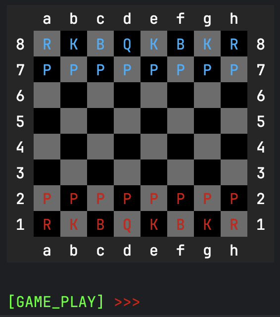
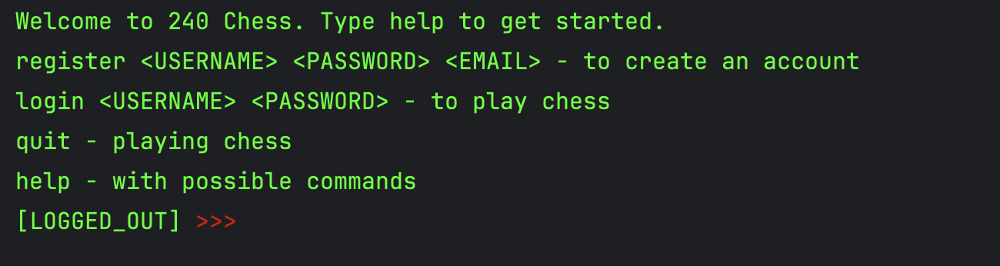

* # ♟️ Chess Game

A Java-based terminal chess game built using a modular architecture with client-server communication and full game logic implementation. Developed using **Test-Driven Development** and organized with a standard **Maven project structure**.

*Sample in-game view and help menu.*

---

## 🧩 Project Structure

The project is divided into three main modules:

- **Client**  
  The command-line interface where players can:
  - Register and sign in
  - Search and join active games
  - View the game board and move pieces
  - Access help menus and game history

- **Server**  
  The server handles:
  - Game coordination and matchmaking
  - Persistent data storage using a MySQL database
  - Real-time updates using WebSockets
  - HTTP routing for user registration and authentication

- **Shared**  
  Encapsulates:
  - Core chess rules (valid moves, check, checkmate, etc.)
  - Turn management
  - Game state serialization

---

## 🧪 Testing

The entire codebase was developed using **Test-Driven Development (TDD)**. Comprehensive unit tests validate:
- Game logic and rules
- Client-server communication
- Data persistence
- User authentication
